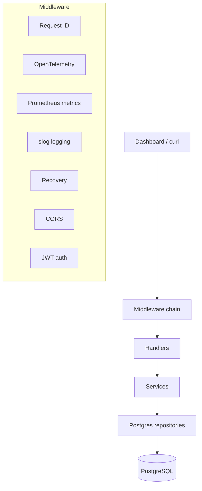

# SDD Navigator API (Go)

Production-oriented REST API for the [SDD Navigator Dashboard](../README.md).

## Stack

| Area | Technology |
|------|------------|
| HTTP | chi v5 |
| Database | PostgreSQL 16, pgx pool |
| Auth | JWT (HS256) + bcrypt |
| Logging | `log/slog` (JSON in production) |
| Metrics | Prometheus (`/metrics`) |
| Tracing | OpenTelemetry OTLP gRPC (Jaeger / Grafana Tempo via collector) |
| Docs | swaggo/swag |
| Tests | testify, httptest, testcontainers-go |
| CI | GitHub Actions |

## Architecture



### Request lifecycle

1. **Request ID** — `X-Request-ID` generated or forwarded, stored in context.
2. **OpenTelemetry** (optional) — HTTP span + W3C trace propagation.
3. **Metrics** — latency / status recorded for Prometheus.
4. **Tracing (slog)** — debug lifecycle logs with `trace_id` + `request_id`.
5. **Logging** — structured access log after response.
6. **Recovery** — panic → JSON `500`, stack in logs only.
7. **CORS** — allow-list check.
8. **Handler** — parse HTTP → call service → JSON response.
9. **Service** — business rules, validation, orchestration.
10. **Repository** — parameterized SQL, query timeouts, DB metrics.

### Layer rules

| Layer | Responsibility |
|-------|----------------|
| `handler/` | HTTP only — no SQL, no business rules |
| `service/` | Business logic — no HTTP types |
| `repository/postgres/` | Persistence only — no HTTP |

## API (frontend contract)

| Method | Path | Auth |
|--------|------|------|
| GET | `/health` | No |
| GET | `/metrics` | No |
| POST | `/auth/login` | No (rate limited) |
| POST | `/auth/refresh` | No (rate limited) |
| GET | `/dashboard/stats` | Bearer |
| GET | `/specifications` | Bearer |
| GET | `/specifications/{id}` | Bearer |
| GET | `/coverage/{specId}` | Bearer |
| GET | `/reports/export/{specId}?format=pdf\|csv\|json` | Bearer |

Success envelope:

```json
{ "data": {}, "meta": { "page": 1, "pageSize": 20, "total": 30, "totalPages": 2 } }
```

Error envelope (Axios-compatible `message` field):

```json
{ "error": "unauthorized", "message": "unauthorized", "code": "unauthorized" }
```

Swagger UI: `http://localhost:4000/swagger/index.html`

## Setup

**Requirements:** Go 1.23+, Docker (optional), PostgreSQL 16.

```bash
cd backend
cp .env.example .env
# JWT_SECRET — min 32 chars

docker compose up -d postgres
go run ./cmd/api
```

Or full stack:

```bash
export JWT_SECRET=your-local-secret-at-least-32-characters-long
docker compose up --build
```

Production-oriented compose (no host DB port, optional nginx/otel profiles):

```bash
docker compose -f docker-compose.prod.yml --profile observability up --build
docker compose -f docker-compose.prod.yml --profile proxy up --build
```

## Environment variables

See [`.env.example`](./.env.example). Key variables:

| Variable | Description |
|----------|-------------|
| `DATABASE_URL` | PostgreSQL DSN (required) |
| `JWT_SECRET` | HS256 secret, min 32 chars |
| `METRICS_ENABLED` | Expose `/metrics` (default `true`) |
| `OTEL_ENABLED` | OTLP tracing (default `false`) |
| `OTEL_EXPORTER_OTLP_ENDPOINT` | e.g. `localhost:4317` or `otel-collector:4317` |
| `RATE_LIMIT_RPS` / `RATE_LIMIT_BURST` | Per-IP limit on `/auth/*` |
| `DB_QUERY_TIMEOUT` | Repository query timeout |

## Testing

```bash
# Unit tests
make test

# Integration tests (Docker required)
make test-integration

# Lint (install golangci-lint locally)
make lint
```

Integration tests spin up PostgreSQL via **testcontainers**, run migrations, and exercise HTTP handlers end-to-end.

## CI/CD

Workflow: [`.github/workflows/ci.yml`](./.github/workflows/ci.yml)

| Job | Steps |
|-----|-------|
| `quality` | gofmt, go vet, golangci-lint, unit tests + coverage artifact |
| `integration` | `go test -tags=integration` with Docker |
| `docker` | `docker build` |

## Observability

### Logs (slog)

- Production: JSON to stdout.
- Fields: `method`, `path`, `status`, `duration`, `client_ip`, `request_id`, `trace_id`.

### Metrics (Prometheus)

`GET /metrics` — `http_requests_total`, `http_request_duration_seconds`, `http_errors_total`, `db_query_duration_seconds`.

### Tracing (OpenTelemetry)

Enable:

```env
OTEL_ENABLED=true
OTEL_EXPORTER_OTLP_ENDPOINT=localhost:4317
```

Compatible with **Jaeger** and **Grafana Tempo** through an OTLP collector (`deploy/otel-collector.yaml`).

## Connect the Next.js dashboard

1. `NEXT_PUBLIC_API_URL=http://localhost:4000`
2. Use [`lib/auth.ts`](../lib/auth.ts) in NextAuth (not inline `mock-token`).
3. Login: `test@test.com` / `123456` (demo user seeded on startup).

## API examples

```bash
# Login
curl -s -X POST http://localhost:4000/auth/login \
  -H "Content-Type: application/json" \
  -d '{"email":"test@test.com","password":"123456"}'

# Dashboard
TOKEN=<accessToken>
curl -s http://localhost:4000/dashboard/stats -H "Authorization: Bearer $TOKEN"

# Metrics
curl -s http://localhost:4000/metrics
```

## Commands

```bash
make run
make build
make swagger   # regenerate docs/
make tidy
```

## Security notes

- bcrypt password hashes; JWT validated with algorithm allow-list.
- CORS allow-list; rate limiting on auth endpoints.
- SQL via bound parameters; `sortBy` column whitelist.
- Secrets from environment only.
- Panics never exposed to clients.
